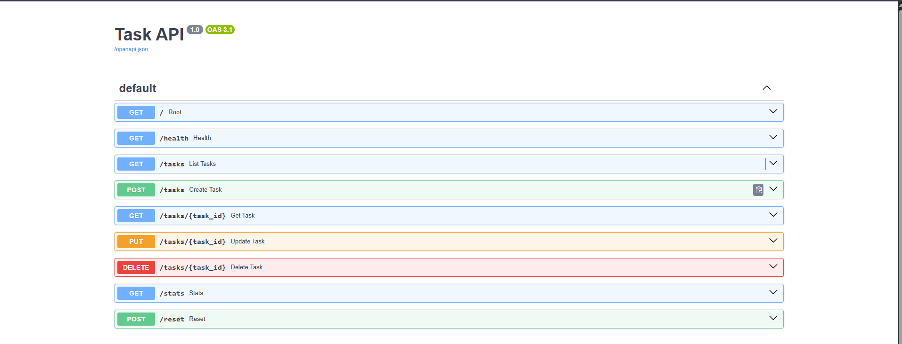

# Task API

A CRUD API for managing a to-do list, built with FastAPI (Python) and MySQL.

## Prerequisites

- Python 3.10+
- MySQL 8.0 running on port 3307

## How to install & run

```bash
# Install dependencies
pip install fastapi uvicorn mysql-connector-python python-dotenv

# Create .env file with your MySQL credentials
echo DB_HOST=localhost > .env
echo DB_PORT=3307 >> .env
echo DB_USER=root >> .env
echo DB_PASSWORD=karan >> .env
echo DB_NAME=task_api >> .env

# Create the database and table (run once)
mysql -u root -p -P 3307 -e "CREATE DATABASE IF NOT EXISTS task_api"
mysql -u root -p -P 3307 task_api -e "CREATE TABLE IF NOT EXISTS api_tasks (id INT AUTO_INCREMENT PRIMARY KEY, title VARCHAR(255) NOT NULL, done TINYINT(1) NOT NULL DEFAULT 0)"

# Start the server
uvicorn main:app --host 0.0.0.0 --port 8000
```

Open http://localhost:8000 in your browser.

## Endpoints

| Method | Path | Description | Status codes |
|--------|------|-------------|--------------|
| GET | `/` | API info | 200 |
| GET | `/health` | Health check | 200 |
| GET | `/tasks` | List all tasks | 200 |
| GET | `/tasks/{id}` | Get one task | 200, 404 |
| POST | `/tasks` | Create a task | 201, 400 |
| PUT | `/tasks/{id}` | Update a task | 200, 400, 404 |
| DELETE | `/tasks/{id}` | Delete a task | 204, 404 |
| GET | `/stats` | Task statistics | 200 |
| POST | `/reset` | Reset to sample tasks | 200 |

## Swagger UI

Open http://localhost:8000/docs for interactive API documentation.

## Example

```bash
$ curl -i http://localhost:8000/tasks/1
HTTP/1.1 200 OK
content-type: application/json

{"id":1,"title":"Buy groceries","done":false}
```

## curl test outputs

```
$ curl -i http://localhost:8000/
HTTP/1.1 200 OK
content-type: application/json

{"name":"Task API","version":"1.0","endpoints":["/tasks"]}

$ curl -i http://localhost:8000/health
HTTP/1.1 200 OK
content-type: application/json

{"status":"ok"}

$ curl -i http://localhost:8000/tasks
HTTP/1.1 200 OK
content-type: application/json

[{"id":1,"title":"Buy groceries","done":false},{"id":2,"title":"Read a book","done":true},{"id":3,"title":"Learn FastAPI","done":false}]

$ curl -i -X POST http://localhost:8000/tasks -H "Content-Type: application/json" -d '{"title":"Buy milk"}'
HTTP/1.1 201 Created
content-type: application/json

{"id":4,"title":"Buy milk","done":false}

$ curl -i -X POST http://localhost:8000/tasks -H "Content-Type: application/json" -d '{}'
HTTP/1.1 400 Bad Request
content-type: application/json

{"error":"body.title: field required"}

$ curl -i -X PUT http://localhost:8000/tasks/1 -H "Content-Type: application/json" -d '{"title":"Updated","done":true}'
HTTP/1.1 200 OK
content-type: application/json

{"id":1,"title":"Updated","done":true}

$ curl -i -X DELETE http://localhost:8000/tasks/2
HTTP/1.1 204 No Content

$ curl -i http://localhost:8000/tasks/99
HTTP/1.1 404 Not Found
content-type: application/json

{"detail":"Task 99 not found"}
```

## Screenshots


